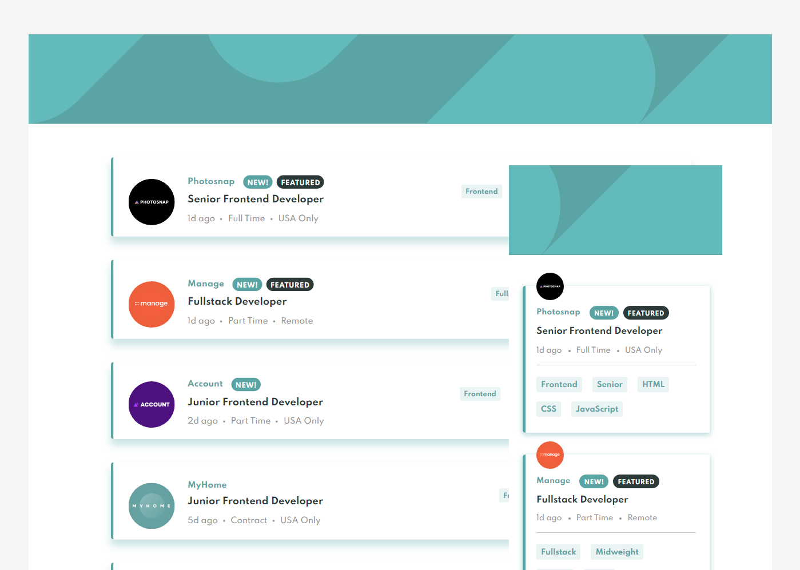

# Frontend Mentor - Job listings with filtering solution

This is a solution to the [Job listings with filtering challenge on Frontend Mentor](https://www.frontendmentor.io/challenges/job-listings-with-filtering-ivstIPCt). Frontend Mentor challenges help you improve your coding skills by building realistic projects.

## Table of contents

1. The Challenge
1. Screenshot of My Work
1. My Process
1. Author
1. Acknowledgements

## Overview

### The challenge

Users should be able to:

- View the optimal layout for the site depending on their device's screen size
- See hover states for all interactive elements on the page
- Filter job listings based on the categories

### Screenshot

### Links

- Live Site URL: [Live Site](https://rouwe.github.io/fem_job_listings_with_filtering/)

## My process

I started by creating my own component builder using classes that will generate each of the job posts when the website loads while styling the components along the way. Lastly, the filtering script. It's not a perfect but I'm happy since I manage to do it on my own.

### Built with

- Semantic HTML5 markup
- CSS custom properties
- Flexbox
- CSS Grid
- Mobile-first workflow
- Vanilla JavaScript
- jQuery

### What I learned

I've gained a lot from this project. My understanding and application of DOM manipulation increases since I really need to figure it out how to incorporate DOM methods with the object/class that I created. This allows me to clearly see and experience first-hand the mess and amount of code it would take to dynamically generate elements using pure JS. I tried mixing in some jQuery in my scripts. I know that my current knowledge is not sufficient to create an efficient filter but, I will take this as my first step towards other things that I will build in the future.

### Continued development

Improvement of filtering and overall script.

## Author

- Frontend Mentor - [@Rouwe](https://www.frontendmentor.io/profile/rouwe)

## Acknowledgments

I'm thankful for Frontend Mentor's challenges. Since this will allow me to hone my skills further.
